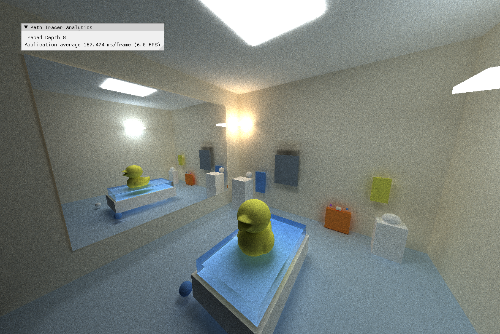

Introduction
======================================
- 👋 Hi, I’m Haralambos (Harris) Kokkinakos 
- 👀 I'm seeking opportunities in Gameplay and/or Graphics Engineering
- 🌱 I finish my master's degree in Computer Graphics and Game Technology at The University of Pennsylvania in Fall 2025
- 🎮 My proficiencies include: C++, OpenGL, Unity, Unreal Engine, WebGPU, CUDA, and more
- 📫 Feel free to contact me at hdkokkinakos@gmail.com or visit my website https://harriskoko.github.io/Harris-Projects/

Highlighted Work
=====================================
## [WebGPU Forward+ and Clustered Deferred Renderer](https://github.com/HarrisKoko/Project4-WebGPU-Forward-Plus-and-Clustered-Deferred)

## [CUDA Path Tracer](https://github.com/HarrisKoko/Project3-CUDA-Path-Tracer)

## [CUDA Boid Simulation](https://github.com/HarrisKoko/Project1-CUDA-Flocking)

<!---
HarrisKoko/HarrisKoko is a ✨ special ✨ repository because its `README.md` (this file) appears on your GitHub profile.
You can click the Preview link to take a look at your changes.
--->
